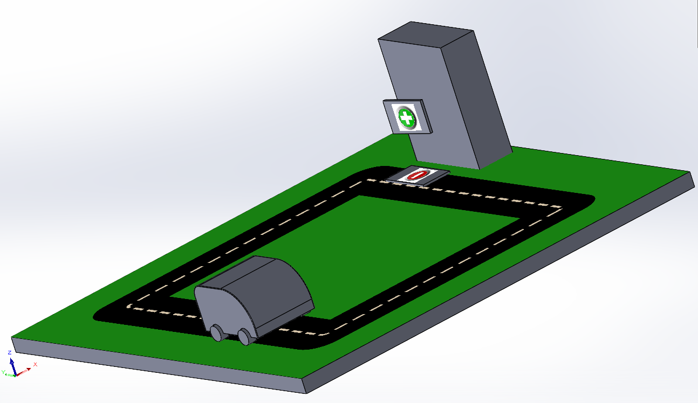

# EV-Charging-Station

## Overview

The **EV-Charging-Station** project aims to create a scalable and reliable electric vehicle (EV) charging system prototype. The system features an automated line-following robot equipped with PID regulation for precise navigation. The robot autonomously follows a path, stops at a designated charging station, and initiates the charging process upon contact. It resumes navigation once the battery state of charge (SoC) reaches the desired level. The system continuously monitors performance metrics to ensure efficiency throughout both the charging and navigation phases.

## Key Features

- **Automated Navigation:** Line-following robot with PID control for accurate path tracking.
- **Charging Process:** Automated contact and initiation of charging at the station.
- **Battery Monitoring:** Resumes navigation based on battery state of charge.
- **Performance Measurement:** Continuous monitoring to optimize system efficiency.

## Getting Started

1. **Build the Robot:** Assemble and configure the line-following robot with PID regulation.
2. **Setup the Charging Station:** Position the station along the robot's path.
3. **Calibration:** Calibrate PID settings and charging parameters.
4. **Run the System:** Start the robot and monitor its performance through the charging and navigation phases.

## Components

- Line-following robot with PID controller
- Charging station with mechanical contact mechanism
- Battery monitoring system

